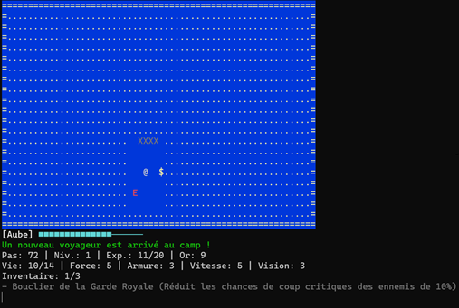
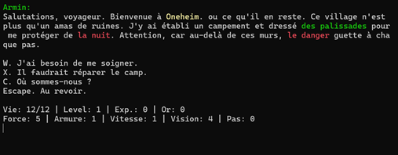
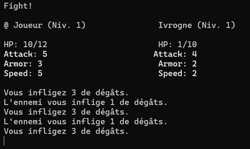

# Oneheim

**Oneheim** est un roguelike console développé en C#/.NET. Le joueur explore une région hostile autour d'un camp de base, récupère des trésors, affronte des vagues de monstres, recrute des alliés et se prépare à l'arrivée de boss majeurs.







## Fonctionnalités principales

- Exploration sur grille avec visibilité dynamique et cycle jour/nuit.
- Combats au tour par tour contre des familles d'ennemis aléatoires.
- Progression par trésors : statistiques, soins, vision et objets équipables.
- Camp de base à défendre contre les sièges ennemis.
- PNJ de service : marchand, recruteur, oracle, jeu de hasard et amélioration d'équipement.
- Boss à paliers de progression, avec ordre d'apparition aléatoire.
- Configuration JSON pour la langue, la difficulté et les raccourcis clavier.

## Prérequis

- SDK .NET compatible avec le projet (`net11.0`).
- Un terminal compatible avec l'affichage console.

Le SDK ciblé par le dépôt est défini dans [`global.json`](global.json). La documentation officielle .NET est disponible ici : <https://learn.microsoft.com/dotnet/>.

## Lancer le jeu

Depuis la racine du dépôt :

```powershell
dotnet run --project Roguelike.Console
```

Le jeu charge automatiquement `Roguelike.Console/gameSettings.json` au démarrage, puis copie ce fichier dans le répertoire de sortie de l'application.

## Configuration

La configuration principale se trouve dans `Roguelike.Console/gameSettings.json`.

```json
{
  "Language": "FR",
  "Difficulty": "Normal",
  "Controls": {
    "MoveUp": "Z",
    "MoveDown": "S",
    "MoveLeft": "Q",
    "MoveRight": "D",
    "Choice1": "W",
    "Choice2": "X",
    "Choice3": "C",
    "Exit": "Escape"
  }
}
```

### Langue

- `FR` : interface en français.
- Toute autre valeur bascule sur la culture anglaise par défaut.

### Difficulté

Valeurs disponibles :

- `Normal`
- `Hard`
- `Hell`

La difficulté influence notamment le nombre de trésors et d'ennemis générés pendant la partie.

### Contrôles par défaut

| Action | Touche |
| --- | --- |
| Monter | `Z` |
| Descendre | `S` |
| Aller à gauche | `Q` |
| Aller à droite | `D` |
| Choix 1 | `W` |
| Choix 2 | `X` |
| Choix 3 | `C` |
| Quitter | `Escape` |

Les valeurs correspondent aux noms de touches .NET (`ConsoleKey`). Consultez la documentation officielle : <https://learn.microsoft.com/dotnet/api/system.consolekey>.

## Documentation du jeu

La documentation détaillée du gameplay est disponible dans [`docs/wiki.md`](docs/wiki.md). Elle couvre notamment :

- le cycle jour/nuit ;
- les vagues et le brouillard ;
- les monstres et familles d'ennemis ;
- les boss ;
- les trésors, objets et raretés ;
- les PNJ et services ;
- le camp de base, le donjon et les mercenaires.

## Structure du projet

```text
Roguelike.Console/   Interface console, rendu, configuration d'exécution
Roguelike.Core/      Moteur de jeu, systèmes de tour, personnages, combats, objets
Screenshots/         Captures d'écran du jeu
```

## Documentation officielle utile

- Documentation .NET : <https://learn.microsoft.com/dotnet/>
- CLI .NET : <https://learn.microsoft.com/dotnet/core/tools/>
- ConsoleKey : <https://learn.microsoft.com/dotnet/api/system.consolekey>
- System.Text.Json : <https://learn.microsoft.com/dotnet/standard/serialization/system-text-json/overview>
